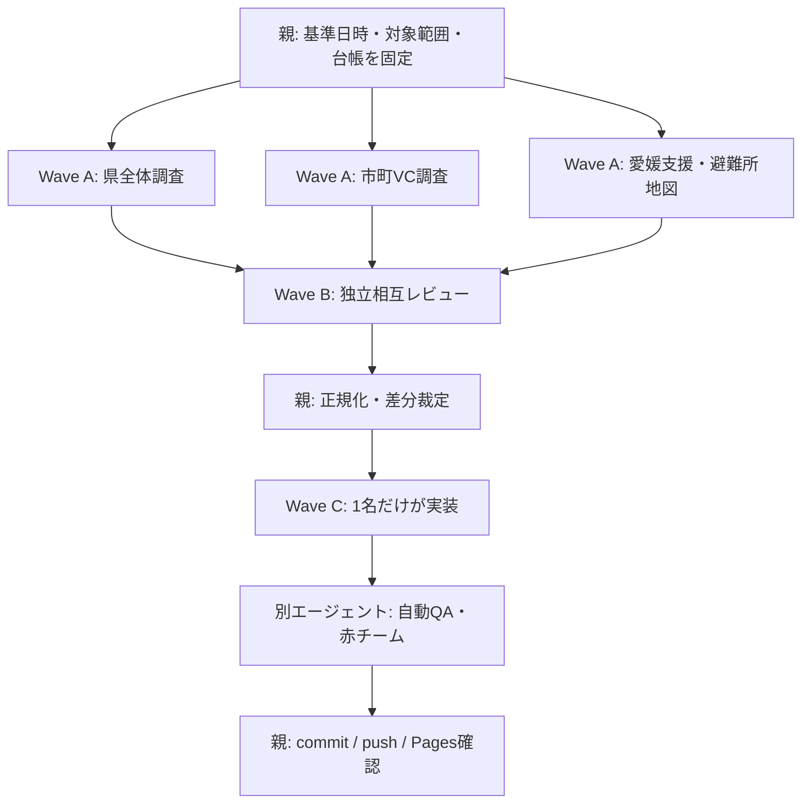

# 時点修正更新オペレーション

## 1. 目的と対象

熊本県への支援・受援ダッシュボードを、最新の公式情報に基づいて時点修正し、既存機能を壊さず、再現可能な手順でGitHub Pagesへ公開するための標準フローである。

対象リポジトリ：`ryotamatsuki/kumamotoshienmap`

主要ファイル：

- `public/dashboard.html`：公開用ダッシュボード本体
- `ehime_kumamoto_support_geocoded_shelters_20260802.html`：レビュー元HTML。公開用HTMLと同一内容に保つ
- `volunteer.js` / `volunteer-data.js` / `volunteer.css`：災害ボランティア機能
- `research_official_*.json`：公式情報の調査・正規化用データ
- `scripts/`：生成、検証、配信ワーカー
- `index.html`：GitHub Pagesのルート入口

## 2. 不変の原則

1. 最初に情報基準日時（JST）を固定し、画面基準日時、公式資料の公表・更新日時、サイト確認日時を別々に管理する。
2. 根拠は自治体、社会福祉協議会、県、国、関係機関の公式Web、PDF、公式SNSに限定する。
3. ページ更新日時だけで採用せず、本文の対象日、活動日、終了・休止、定員到達を読む。
4. 不明は `null`、明示的に不可は `false`、明示的な0は `0`。空欄や不明を0へ変換しない。
5. 「募集なし」「受入不可」「情報未確認」「公表なし」「要確認」「要再確認」を別状態にする。
6. 個人募集、団体フォーム、県外募集、大型バス受入れ、愛媛県からの団体受入れを相互に推定しない。
7. 現況と履歴、予定と実績、県計と市町計を分離する。古い正確な座標は履歴として残し、最新集計と混在させない。
8. サマリー、表、カレンダー、地図、詳細、判断パネル、履歴、出典は一つの正規化データを参照する。
9. 編集前のコミットを保全し、既存タブ、地図、リンク、レスポンシブ表示を削除・簡略化しない。
10. 事実、推定、未確認を画面・データ・報告で明示的に区別する。

## 3. 極限までエージェントを活用する編成

### 3.1 役割と権限

| 役割 | 担当範囲 | 成果物 | 編集権限 |
|---|---|---|---|
| 親・オーケストレーター | 基準日時、allowlist、差分裁定、最終リリース | 台帳、統合、完了判定 | 全体統合 |
| 県全体調査 | 被害、避難、断水、道路、廃棄物、行政応援 | 県全体の調査packet | `research_official_statewide.json`のみ |
| 市町・災害VC調査 | 募集、定員、地域制限、団体、車両、保険、日程 | 市町別調査packet | `research_official_*.json`のみ |
| 愛媛支援調査 | 派遣先、人数、期間、予定・実績、物的支援 | 愛媛支援packet | 専用調査メモのみ |
| 避難所・地図調査 | 既存座標、境界、レイヤー、現況・履歴分離 | 座標・地図検証報告 | 読取専用 |
| コード監査 | DOM、タブ、状態管理、パス、ビルド、既存機能 | 監査報告 | 読取専用 |
| 正規化担当 | packet統合、旧値→新値、重複・表外差分 | 統合データと差分表 | 親の統合ブランチのみ |
| 赤チーム・公開QA | 過大判定、古い値、UI誤読、Pages、コンソール | 独立QA報告 | 読取専用 |

研究担当と実装担当を分け、同じファイルを複数エージェントが同時編集しない。各packetには担当、範囲、確認日時、URL、原文、正規化値、旧値、新値、未解決事項、証跡ハッシュを必須とする。

### 3.2 4枠しかない場合の波状実行



枠が増えた場合は、交通制度、アクセシビリティ、外部リンク監査、公開監視を追加する。fan-inとリリース判定は常に親1名が行う。

## 4. 実行手順

### Phase 0：編集前の固定

```powershell
git status --short
git log -1 --oneline --decorate
git branch --show-current
git pull --ff-only
```

共有作業ツリーでGitの所有者警告が出る場合は、各Gitコマンドに `-c safe.directory=C:/Users/Owner/Desktop/workspace_new/proj_10_kumamotomap` を付ける。未コミット変更がある場合は、pullを先に完了してから編集を開始する。

次を先に宣言する。

- 情報基準日時（JST）
- 対象市町、支援領域、対象期間
- 公式ドメインのallowlist
- エージェントごとの非重複担当範囲
- 前回値を履歴として残す条件

必要なら一時的な `UPDATE-LEDGER.json` と `SOURCE_REGISTRY.json` を作る。各行に `owner`、`scope`、`status`、`claimed_at`、`due_at` を持たせ、期限切れを親が再割当する。公開データでない台帳はコミットしない。

### Phase 1：公式情報のファンアウト

各担当は、1根拠1packetで返す。

```json
{
  "task_id": "volunteer-ashikita-20260811",
  "owner": "Agent-Volunteer",
  "scope": "市町の災害ボランティア募集",
  "reference_at": "2026-08-11T10:00:00+09:00",
  "authority": "公式主体",
  "title": "公式ページ名",
  "url": "https://example.invalid/official",
  "published_at": null,
  "updated_at": null,
  "checked_at": "2026-08-11T10:05:00+09:00",
  "source_updated_at": null,
  "next_review_at": "2026-08-13T10:05:00+09:00",
  "target_period": "本文に記載された期間",
  "exact_excerpt": "判定に必要な短い原文",
  "normalized": {"recruitment_status": "情報未確認"},
  "confidence": "high",
  "previous_value": "募集中",
  "change_status": "日程未確認",
  "unresolved": ["次期募集の有無"],
  "next_contact": "市町社会福祉協議会",
  "evidence_hash": "sha256:..."
}
```

調査ルール：

- 公式ページの本文にある対象日、活動日、終了、休止、定員到達を確認する。
- 公式Webで裏付けられないSNS単独情報は確定値にしない。
- 404、削除、取得失敗は「募集なし」に変換しない。前回値を履歴へ残し、現況を「情報未確認」または「掲載終了・要再確認」とする。
- 県外可、愛媛可、団体可、大型バス可、宿泊可は明示がなければ `null`。
- 予定日が過ぎても実施確認がなければ完了扱いにしない。
- 1日定員、期間定員、動的フォーム残枠、実参加人数を混同しない。

### Phase 2：独立相互レビュー

調査担当と別のエージェントが、次を再確認する。

1. URLの主体、資料名、対象期間が一致しているか。
2. 公表日時、更新日時、サイト確認日時を取り違えていないか。
3. 県計と市町別合計の差、表外市町、重複市町が説明されているか。
4. 現況・履歴、予定・実績、定員・残枠が分かれているか。
5. 個人募集から団体受入れを推定していないか。
6. `null` / `false` / `0` の意味が保たれているか。
7. 地図の座標・境界を新規推定していないか。
8. 古い値が現況ラベル、サマリー、地図凡例に残っていないか。

解消できない相違は双方の根拠を保存し、画面に「公式情報間で相違あり」と表示する。

### Phase 3：正規化と差分

統合データには最低限、次を持たせる。

```text
source_id / authority / title / url
published_at / updated_at / checked_at / target_period
previous_value / current_value / change_status / confidence
exact_excerpt / unresolved / next_contact / evidence_hash
```

このリポジトリの中心データ：

- `NEED_MUNICIPALITIES`：市町別の避難、被害、断水、施設、支援シグナル
- `IMPACTS`：最新の避難所・避難者の市町別集計
- `RECORDS`：国、熊本県、市町、愛媛県等の支援記録
- `TIMELINE_EVENTS`：発災後の出来事、過去予定の実施確認
- `research_official_*.json` → `volunteer-data.js`：災害ボランティア単一データ
- `PREGEOCODED_SHELTER_ROWS` / `shelter-coordinate-manifest.json`：公式座標スナップショット
- `PAGE_RECHECK_META`：全体の確認日時、差分、要再確認

画面に値を直接重複ハードコードしない。差分は旧値・新値・根拠・確認時刻から自動生成する。

### Phase 4：実装

1. DOM、タブ、地図レイヤー、状態管理、外部ライブラリ、相対パスを監査する。
2. 研究結果を正規化データへ統合する。
3. ボランティアデータを生成する。

```powershell
npm run generate:volunteer
```

4. 原本を編集した場合は `Copy-Item -LiteralPath .\ehime_kumamoto_support_geocoded_shelters_20260802.html -Destination .\public\dashboard.html` 等で公開用HTMLを同期し、バイト一致を検査する。どちらを正とするかを作業開始時に固定し、二重編集しない。
5. `index.html` がGitHub Pagesのルートから本体HTMLを参照することを確認する。
6. 既存座標・境界・レイヤーを再利用し、座標のない市町は未表示理由を示す。推測座標を追加しない。
7. 古い値は一律削除せず、現況から外した理由と履歴を残す。
8. 研究エージェントがHTMLを編集した場合は、親が正規化データ経由で統合し直す。

### Phase 5：自動QA

```powershell
npm run generate:volunteer
npm run validate:dashboard
npm run validate:volunteer
npm run validate:shelters
node --check volunteer.js
node scripts/build-sites.mjs
npm run validate:dist
git diff --check
```

WindowsでPowerShellの実行ポリシーにより `npm` が起動できない場合は、同じコマンドを `npm.cmd` に置き換える。CI/Linuxでは `npm` を使う。検証コマンドを一つの長いシェル行に連結せず、失敗箇所が分かる単位で実行する。

一括確認：

```powershell
npm run build
```

追加確認：

- root/public/distのHTML、JavaScript、CSS、データのハッシュが意図どおり一致する。
- GET、HEAD、404、405、主要アセット配信が成功する。
- 旧値の現況表示、人数の0化、団体受入れの過大判定、過去値の現況化を検索する。
- 各データ群の `reference_at`、各根拠の `checked_at`、公表側の `source_updated_at`、`next_review_at` を確認する。最終確認から48時間を超えた値は「要再確認」とし、更新できない場合は前回値を保持して理由を記録する。
- `git add .` は使わず、変更対象を明示してステージする。
- `tmp/`、`*.tar.gz`、取得資料、スクリーンショット、秘密情報をコミットしない。

最小自動ゲートは `generate → validate-dashboard → validate-volunteer → validate-shelters → build-sites → validate-dist` とする。将来はこの順序をCIに移し、freshness（48時間）、root入口、原本/publicバイト一致、Pagesのbase pathをpush前に自動判定する。

### Phase 6：ブラウザとPages

1. `https://ryotamatsuki.github.io/kumamotoshienmap/` を新規に開く。
2. ルートが404で本体HTMLが表示される場合、入口ファイル欠落を優先確認する。
3. GitHub Actionsの `pages-build-deployment` 成功を確認する。
4. ルートURLが本体へ遷移し、タイトル・主要見出しが表示されることを確認する。
5. 6タブ（概要、支援ニーズ見通し、発災後タイムライン、支援ダッシュボード、災害ボランティア、地図）を確認する。
6. 災害ボランティアのサマリーカード、詳細、比較表、カレンダー、地図を操作する。
7. 公式リンク、レスポンシブ表示、キーボード操作、コンソールエラーを確認する。

ブラウザが使えない場合は、未実施を明記し、`npm run build`、各validator、HTTP GET/HEAD/404/405、静的JS構文確認を代替証跡とする。実ブラウザ未確認を「公開確認済み」と報告しない。

Pages不具合の切り分け：

| 症状 | 優先確認 |
|---|---|
| ルートだけ404、本体HTMLは表示 | `index.html`、公開ディレクトリ |
| ルートと本体HTMLが404 | Pages設定、Actions、公開ブランチ |
| HTMLは表示、CSS/JSが404 | 相対パス、ファイル名の大文字小文字 |
| 更新前の画面 | Actions完了、キャッシュ、コミットSHA |
| 地図だけ空白 | Leaflet、タイル、レイヤー、コンソール |

### Phase 7：commit / push

```powershell
git remote -v
git status --short
git diff --check
git add index.html public/dashboard.html ehime_kumamoto_support_geocoded_shelters_20260802.html volunteer.js volunteer-data.js volunteer.css research_official_north.json research_official_south.json research_official_statewide.json scripts/build-sites.mjs scripts/generate-volunteer-data.mjs scripts/validate-dashboard-current.mjs scripts/validate-volunteer-data.mjs scripts/validate-shelter-coordinates.mjs scripts/validate-built-site.mjs package.json 時点修正更新オペレーション.md
git diff --cached --check
git diff --cached --stat
git commit -m "Refresh dashboard with latest official information"
git push -u origin main
git ls-remote https://github.com/ryotamatsuki/kumamotoshienmap.git refs/heads/main
```

push後はローカルHEADとremote SHAの一致、Pages Actions成功、公開URLの実表示を確認してから完了報告する。

## 5. ブロッカー処理

- 公式取得失敗：同一主体の公式PDF・公式ミラー・公式アーカイブを確認し、解決しなければ前回値保持＋要再確認。
- 公式情報の競合：双方のURL、対象期間、更新日時を保存し、「公式情報間で相違あり」。
- 座標欠落：既存公式座標を再利用し、なければ地図未表示＋理由。推定しない。
- フォーム残枠：募集人数・不足人数へ変換しない。
- GitHub Pages 404：入口、公開ブランチ、Actions、公開ディレクトリの順に確認する。
- 同一エラーが3回続く：試行を止め、エラー、SHA、ログURL、必要な権限を報告する。

## 6. 最終ゲート

### 根拠・データ

- [ ] 現況値に一次資料、対象時点、公表主体、確認日時がある
- [ ] 未確認を募集なし、不可、0人へ変換していない
- [ ] 予定・実績、現況・履歴、県計・市町計を分離している
- [ ] 正規化データから全画面を生成している
- [ ] 差分、履歴、要再確認を保持している
- [ ] criticalな根拠に `next_review_at` があり、48時間超は「要再確認」になっている

### 機能・品質

- [ ] 既存タブ、地図、リンク、レスポンシブ表示が動作する
- [ ] ボランティアの詳細、フィルター、並べ替え、カレンダー、地図レイヤーが動作する
- [ ] `npm run build`、`node --check`、`git diff --check`、配信検証が成功した
- [ ] 明示したファイルだけをcommitした
- [ ] remote SHA、Pages Actions、公開URL、コンソールエラーを確認した

現行リポジトリにPages用GitHub Actionsがない場合、pushだけでデプロイ成功とはみなさない。Actionsの有無を確認し、公開URLのGETと画面操作を手動で記録する。CIを導入する場合は、Node/npmのバージョンとlockfileを固定し、`npm ci` → `npm run build` → artifact公開 → Pagesデプロイの順にする。

## 7. 標準完了報告

1. 編集したサイトとコミットSHA
2. 追加・更新した主要機能
3. 再探索した公式情報源の範囲
4. 登録・更新した市町数と集計基準
5. 要確認・情報未確認として残した主要事項
6. 情報基準日時とサイト確認日時
7. 自動QA、Pagesデプロイ、公開URLの実測結果
8. 変更した主要ファイル

確認できない事実を完了報告で補わない。公開確認ができない場合は「未確認」と明記し、公開済みとは報告しない。
